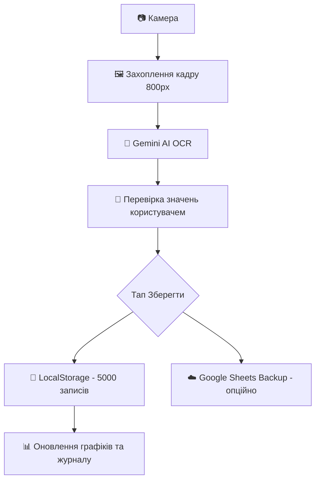

# 🩺 BP Monitor — Документація проекту

> **Статус:** ✅ Повністю робочий (Production Ready)  
> **Остання редакція:** 15 квітня 2026 р.  
> **Сайт:** [https://kostyaov.github.io/bp-monitor/](https://kostyaov.github.io/bp-monitor/)  
> **Репозиторій:** [https://github.com/Kostyaov/bp-monitor](https://github.com/Kostyaov/bp-monitor)

---

## 📊 Стадія розробки

| Функція | Статус | Коментар |
|---|---|---|
| 📷 Автозахоплення камери | ✅ OK | Робота з мобільними браузерами |
| 🤖 AI OCR (Gemini 2.5 Flash) | ✅ OK | Пряма інтеграція через API |
| ✏️ Ручне введення/правка | ✅ OK | Повна валідація даних |
| 💾 Сховище (localStorage) | ✅ OK | **До 5000 записів** |
| 📤 Cloud Backup (GAS) | ✅ OK | Опційно в Google Sheets |
| 📊 Візуалізація (Графіки) | ✅ OK | Chart.js: День / Тиждень / Місяць |
| 📜 Керування журналом | ✅ OK | Редагування та видалення записів |
| 📥 Експорт даних | ✅ OK | Генерація XLSX файлів |
| 📱 UI/UX (Glassmorphism) | ✅ OK | Адаптивність та анімації |
| 🔍 Фільтрація та аналітика | ⬜ План | Пошук за датами та статистика |

---

## 🏗️ Архітектура та Технології

Система побудована як **Serverless Web App (SPA)**, що дозволяє працювати максимально швидко та приватно.

*   **Frontend**: Vanilla HTML5, CSS3 (Glass Design), Modern JS.
*   **AI Engine**: [Google Gemini 2.5 Flash](https://aistudio.google.com/app/apikey) — найшвидша модель для розпізнавання тексту з зображень.
*   **Database**:
    *   **Primary**: `localStorage` (зберігає до 5000 записів локально на вашому пристрої).
    *   **Backup**: Google Sheets через **Google Apps Script (GAS)** (опційно).
*   **Libraries**:
    *   `Chart.js` — інтерактивні графіки показників.
    *   `SheetJS` — професійний експорт у XLSX.
    *   `Lucide` — набір іконок.

---

## 🚀 Швидке розгортання (4 кроки)

### 1. Хостинг (GitHub Pages)
Просто зробіть `fork` або `clone` репозиторію та увімкніть **GitHub Pages** у налаштуваннях вашого репо (**Settings → Pages → Source: main branch**).

### 2. Google Apps Script (Backup) — *Опційно*
1. Створіть нову таблицю в [Google Sheets](https://sheets.new).
2. Відкрийте **Extensions → Apps Script**.
3. Вставте код з файлу `Code.gs` (дивіться нижче).
4. Натисніть **Deploy → New Deployment** (Type: Web app, Access: Anyone).
5. Скопіюйте отриманий URL.

### 3. Gemini API Key — *Обов'язково*
Отримайте безкоштовний ключ у [Google AI Studio](https://aistudio.google.com/app/apikey). Цей ключ потрібен браузеру для "читання" чисел з ваших фото.

### 4. Налаштування в додатку
Відкрийте ваш сайт, натисніть іконку **⚙️** (Settings) та вставте:
*   **Gemini API Key**: Ваш ключ `AIza...`
*   **GAS URL**: URL вашого скрипта (якщо робили Крок 2).

---

## ⚙️ Потік даних (Workflow)



### Деталі OCR:
Ми використовуємо прямий запит до Gemini API з браузера (через CORS). Зображення стискається до 800px для економії трафіку та прискорення розпізнавання на мобільних телефонах.

---

## 🗄️ Структура даних

### localStorage (Ключ: `bp_history`)
Масив об'єктів формату:
```json
{
  "date": "2026-04-15T12:00:00.000Z",
  "sys": 120,
  "dia": 80,
  "pul": 72
}
```

### Google Sheets
Скрипт автоматично створює лист **"History"** з колонками:
`Дата і час | SYS | DIA | PUL`

---

## 🔑 Ліміти Gemini API (Free Tier)
Наразі безкоштовний рівень дозволяє робити **20 запитів на хвилину** та до **1500 на день**. Цього більше ніж достатньо для персонального моніторингу (запас у ~375 разів від типового використання).

---

## 💻 Повний Code.gs (Для Кроку 2)

```javascript
/**
 * BP Monitor — Google Apps Script (Backup)
 * Розгортання: Deploy → New Deployment → Web app
 * Execute as: Me | Who has access: Anyone
 */

function doGet() {
  return HtmlService.createHtmlOutput('<h2>✅ BP Monitor backup — running</h2>');
}

function doPost(e) {
  try {
    const data = JSON.parse(e.postData.contents);
    const ss    = SpreadsheetApp.getActiveSpreadsheet();
    let   sheet = ss.getSheetByName('History');

    if (!sheet) {
      sheet = ss.insertSheet('History');
      sheet.appendRow(['Дата і час', 'SYS', 'DIA', 'PUL']);
      sheet.getRange(1, 1, 1, 4).setFontWeight('bold').setBackground('#f3f3f3');
    }

    const ts = data.date ? new Date(data.date) : new Date();
    sheet.appendRow([ts, Number(data.sys) || 0, Number(data.dia) || 0, Number(data.pul) || 0]);

    return ContentService
      .createTextOutput(JSON.stringify({ status: 'ok' }))
      .setMimeType(ContentService.MimeType.JSON);

  } catch (err) {
    return ContentService
      .createTextOutput(JSON.stringify({ status: 'error', message: err.toString() }))
      .setMimeType(ContentService.MimeType.JSON);
  }
}
```

---

## 🌐 Корисні посилання
*   [Google AI Studio (API Keys)](https://aistudio.google.com/app/apikey)
*   [Gemini API Documentation](https://ai.google.dev/api/generate-content)
*   [SheetJS Documentation](https://docs.sheetjs.com/)

*Документація оновлена: 15.04.2026 | Версія продукту: `Production 1.2`*
